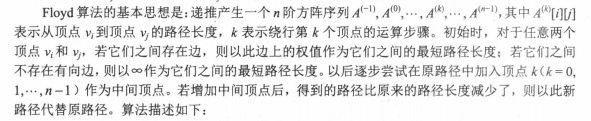

# 算法总结

## 串

kmp算法(初始)

```cpp

void get_next(int* next, char* T, int T_len){
    next[0] = -1;
    int i = 0, j = -1;
    while(i < T_len -1){
        if(j == -1||T[i] == T[j]){
            next[i+1] = j+1;
            i++;
            j++;
        }else{
            j = next[j];
        }
    }
}

//void get_next_val(int* next, char* T, int T_len){
//    for(int i = 1;i<T_len;i++){
//        if(T[i] == T[next[i]]){
//            next[i] = next[next[i]];
//        }
//    }
//}

int KMP(char* S, int S_len, char* T, int T_len, int* next){
    int i = 0, j = 0;
    while(i < S_len && j < T_len){
        if(j == -1||S[i] == T[j]){
            i++;
            j++;
        }else{
            j = next[j];
        }
    }
    if(j>=T_len)return i-T_len;
    else return 0;
}
```

KMP算法（改进）

```cpp

void get_nextval(int* next, char* T, int T_len){
    int i = 0, j = -1;
    next[i] = -1;
    while(i<T_len-1){
        if(j == -1|| T[i] == T[j]){
            next[i+1] = j+1;
            if(T[i+1] == T[next[i+1]])next[i+1] = next[j+1];
            i++;
            j++;
        }else{
            j = next[j];
        }
    }
}
```

## 栈

对于n个不同的元素进栈，出栈序列的个数为${1/{n+1}}*C^n_{2n}$

表达式转换（前缀、中缀、后缀）

中转后：从左向右顺序扫描，如果是字符直接输出；如果是运算符，则和栈顶运算符比较优先级，若优先级**高于**栈内符号，则入栈；若优先级**小于等于**栈顶符号，则将栈顶元素输出，然后入栈。（左括号入栈前优先级最高，入栈后优先级最低；遇到右括号，则将栈顶与相应左括号之间的元素全部出栈，左右括号输出时全丢弃）

中转前：从右往左扫描（输出时也是从右向左输出），如果是字符直接输出；如果是运算符，则和栈顶运算符比较优先级，若优先级**高于或等于**栈内符号，则入栈；若优先级**小于**栈顶符号，则将栈顶元素输出，然后入栈。（右括号入栈前优先级最高，入栈后优先级最低；遇到左括号，则将栈顶与相应右括号之间的元素全部出栈，左右括号输出时全丢弃）

后转前（后转中）：从左往右扫描，如果是字符则入栈，如果是运算符，则从栈中取出最顶层的两个表达式，与该运算符重新组成表达式并入栈，最后栈中所剩最后一个表达式即为结果。

## 图

**求最小生成树**

普里姆（Prim）算法：初始时从图中选取任意一个顶点加入树中，然后再选取一个与当前树中顶点集合距离最近的顶点加入树中，直到所有顶点加入树中。 适用于求解边稠密图的最小生成树。

克鲁斯卡尔（Kruskal）算法：按照边的权值由小到大的顺序，不断选取当前未被选取过且权值最小的边，如该边依附的顶点在不同的连通分量上，则将该边加入树中，否则丢弃。 适合边稀疏且顶点较多的图。

**求最短路径**

Dijkstra算法：Dijkstra算法设置一个集合S记录己求得的最短路径的顶点，初始时把源点V放入S,集合S每并入一个新顶点v,都要修改源点V到集合V-S中顶点当前的最短路径长度值。（算法中不允许出现带负权值的边）时间复杂度O($V^2$)

Floyd算法：

算法中不允许出现带负权值的边组成的回路。

时间复杂度O($V^3$)

## 查找

**哈夫曼树**：若要将n个节点组成k叉哈夫曼树，则需要添加(n-1)%(k-1)个0节点。
